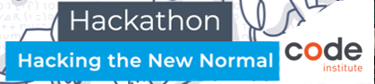
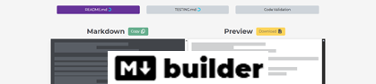
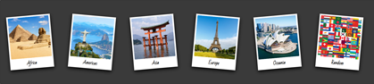
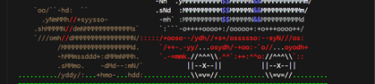
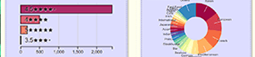

| Socials | Connect | |
| --- | --- | --- |
| GitHub |  |  |
| LinkedIn |  | |
| YouTube |  | |
| Minecraft |  | A safe and inclusive Minecraft SMP. |
| Duolingo |  | 🇺🇸 🇩🇪 🇫🇷 🇪🇸 🇯🇵 🇮🇪 🇷🇺 🇸🇦 |

## Featured Projects

